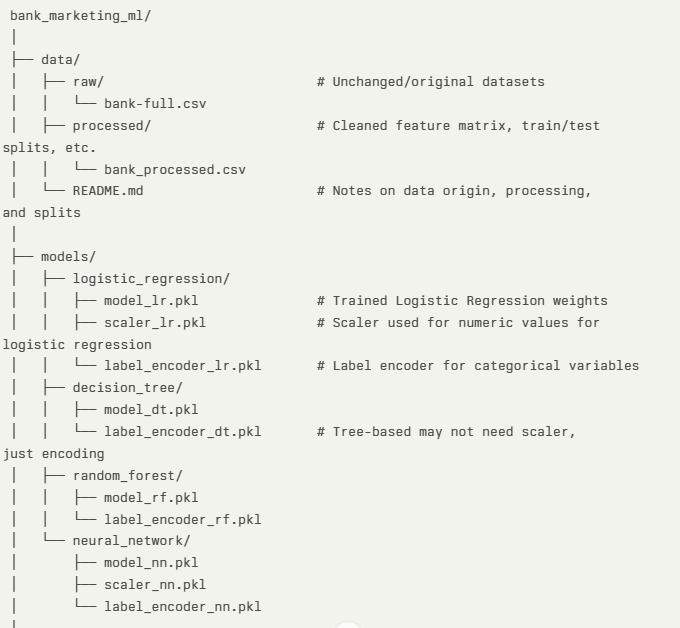
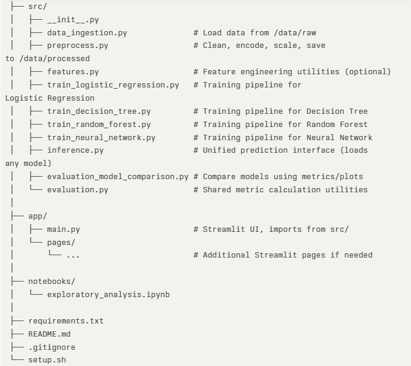
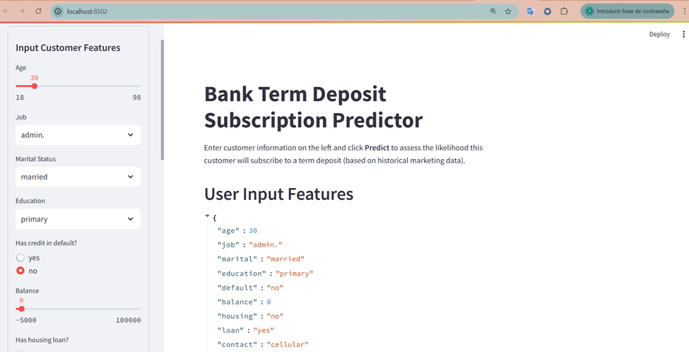
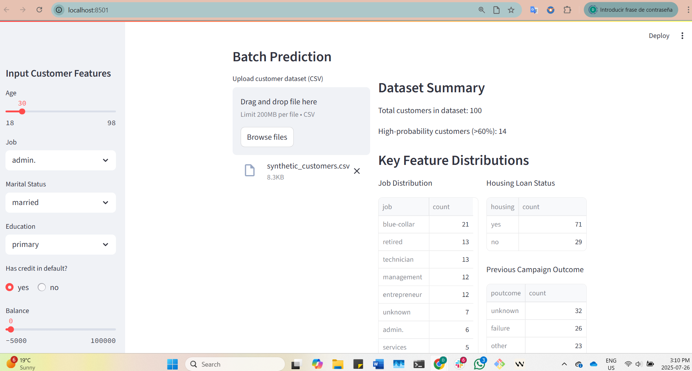

# Strategic Marketing: Insights from the Bank Marketing Dataset


Data Science Institute - Cohort 6 - ML Team 07  Project Report

---

**Members**  

Rajthilak Chandran  
Feihong Nan  
Darling, Oscanoa  
Rehan, Ahmed  
Rituparna, Bera  
Jenniffer Carolina, Triana Martinez

---

## Executive Summary

This project applies supervised machine learning to improve the performance of a bank's direct marketing campaign. By predicting which clients are most likely to subscribe to a term deposit, the model helps reduce outreach costs, increase conversion rates, and support smarter targeting.

Key outcomes:

- Developed and compared three models: Decision Tree, Random Forest, and Neural Network  
- Neural Network achieved the highest test accuracy (81%) and ROC-AUC (~0.94)  
- Applied SHAP analysis for transparent insights into feature impact  
- Delivered an interactive Streamlit dashboard for business users  
- Proposed deployment roadmap including API integration and performance monitoring  

The project balances predictive rigor with real-world usability, enabling data-driven decisions that deliver measurable business value.

---

## Business Case

In today’s competitive banking environment, direct marketing campaigns often yield disappointingly low conversion rates. Traditional outreach strategies waste resources by indiscriminately contacting clients who are unlikely to respond. This leads to inefficient spending, strained customer relationships, and missed opportunities.

Our project directly tackles this challenge by leveraging machine learning to identify which clients are most likely to subscribe to a term deposit. With predictive targeting, banks can strategically focus their efforts on the right audience—leading to stronger returns on investment, lower outreach costs, and improved customer engagement.

This shift from guesswork to guided decisions empowers marketing and sales teams to operate with purpose and precision, driving real business impact through smarter campaign execution.

> **Goal:** Build a predictive model that increases marketing efficiency by prioritizing high-likelihood responders and minimizing unnecessary outreach.

---

## Project Objective

We aim to transform how banks and financial institutions connect with clients by integrating machine learning into marketing workflows. Rather than casting a wide net, our model enables teams to make informed, data-driven decisions about who to contact, when, and how.

Core objectives include:

- Improve subscription rates through predictive client profiling  
- Reduce marketing overhead by limiting outreach to low-probability leads  
- Enhance campaign personalization to boost customer satisfaction  
- Equip non-technical users with interpretable insights via streamlined dashboards  

In an evolving digital landscape, the ability to prioritize high-value leads, and back those decisions with data creates measurable advantages in operational efficiency, customer acquisition, and strategic growth.

---

## Project Structure





---

## Project Overview

**Who are your stakeholders and why do they care about your project?**

***Stakeholders***

Marketing Teams: Want to optimize campaign ROI

Sales Teams: Need qualified leads

Executives: Focused on strategic growth and cost reduction

Clients: Benefit from more relevant and personalized outreach

**How will you answer your business question with your chosen dataset?**

We’re using the Bank Marketing dataset from UCI, which contains detailed information about clients, their previous interactions with marketing campaigns, and several economic indicators. Our goal is to help the bank improve its conversion rate, the percentage of contacted clients who end up subscribing to a term deposit.

To do this, we started by exploring the dataset to uncover patterns and relationships that might influence a client’s decision. We then cleaned and prepared the data, making sure it was ready for modeling by handling categorical variables and addressing class imbalance.
Next, we built machine learning models to predict whether a client is likely to subscribe. These predictions allow the bank to focus its outreach on individuals who are more likely to respond positively. We evaluated our models using metrics like precision, recall, F1-score, and ROC-AUC to ensure they’re both accurate and practical.

To make our results interpretable, we used SHAP values to explain which features are most influential in the model’s predictions. This helps the bank understand what drives client behavior and supports more informed decision-making.

By identifying high-potential leads, our approach directly supports the bank’s ability to improve its conversion rate, which is a key performance indicator for marketing success.

**What are the risks and uncertainties?**

We’re aware that certain features like call duration might inflate our model’s performance, so we’re testing models with and without it to make sure our predictions are realistic. We’re also dealing with class imbalance, which could affect how well our model identifies potential subscribers. Our goal is to build a model that not only performs well technically but also helps improve the conversion rate in a way that’s reliable and scalable.

> #### Data and Modeling Risks
> 
> -   **Imbalanced Target Variable**: The dataset has a significant class imbalance (i.e., many more "no" responses than "yes"), which may bias the model toward the majority class.
>     
> -   **Historical Bias**: Marketing decisions in past campaigns (e.g., whom to contact or how frequently) may reflect real-world human biases. The model may learn and replicate them.
>     
> -   **Feature Leakage**: The  `duration`  feature, while predictive, is not usable during deployment as it’s only known after the call — it has been dropped from training data.
>     
> -   **Client Behavior Drift**: Economic conditions and consumer behavior change over time, which may limit the long-term reliability of the trained model.
>     

**What methods and technologies will you use?**

We’re using Python and tools like scikit-learn, xgboost, and shap to build and explain our models. Everything is tracked in GitHub, and we’re following best practices for collaboration. Our reproducible notebook shows how our model can be used to predict outcomes and support decisions that directly impact the bank’s conversion rate, a key metric for campaign success.

**Planned Workflow and Technologies**


> #### Methodology and Workflow
> 
> -   **Data Preprocessing**: Clean categorical variables, handle outliers, encode features, drop leakage columns, and filter to meaningful segments (e.g., previously contacted clients).
>     
> -   **Exploratory Data Analysis (EDA)**: Understand distribution, correlation, imbalance, and relationships (e.g., between  `poutcome`,  `previous`, and  `y`).
>     
> -   **Modeling**: Evaluate classification algorithms like Logistic Regression, Random Forest, and XGBoost with class imbalance handling techniques (SMOTE, class weights).
>     
> -   **Evaluation Criteria**: Models will be evaluated using  **Precision**,  **Recall**,  **F1 Score**, and  **ROC-AUC**, with an emphasis on minimizing false positives (wrongly identifying likely subscribers).
>     
> -   **Technology Stack**: Python (Pandas, NumPy, Seaborn, Scikit-learn, XGBoost), Jupyter Notebooks
>     

---

## Requirements


&nbsp;
&nbsp;


This project relies on a suite of Python libraries and frameworks that support end-to-end data science workflows, including data preprocessing, machine learning, model evaluation, interpretability, and visualization:

---

### **Core Libraries**


* **pandas** – Essential for structured data manipulation, cleaning, and tabular analysis  
* **NumPy** – Powers efficient numerical computations and matrix operations


### **Machine Learning and Modeling**


* **scikit-learn** – Provides robust tools for supervised learning, preprocessing, model selection, and validation. Notable components:  
  * Estimators: `RandomForestClassifier`, `DecisionTree`, `NeuralNetwork`  
  * Pipelines and Transformers: `Pipeline`, `ColumnTransformer`, `StandardScaler`, `OneHotEncoder`  
  * Evaluation and Tuning: `accuracy_score`, `confusion_matrix`, `classification_report`, `mean_squared_error`, `GridSearchCV`, `StratifiedKFold`
* **Keras/Tensor Flow** - Enable deep learning model development and training with flexible neural network building blocks
* **lightgbm** – Provides high-speed gradient boosting via `LGBMClassifier`, optimized for large datasets  
* **imblearn (imbalanced-learn)** – Offers strategies for handling imbalanced data, including `SMOTE` and `SMOTENC`


### **Visualization and Diagnostics**


* **matplotlib** – Standard library for creating visualizations and plots  
* **scikit-plot** – Enhances plotting of classifier performance and metrics  
* **missingno** – Visualizes missing data patterns to support quality assessments  
* **ydata\_profiling** – Automates exploratory data analysis with comprehensive data profiling reports


### **Optimization and Interpretability**


* **hyperopt** – Facilitates hyperparameter tuning using Bayesian optimization via components such as `tpe`, `Trials`, `hp`, `fmin`, and `space_eval`  
* **shap** – Enables model interpretability through SHAP (SHapley Additive Explanations), highlighting feature contributions to predictions


### **System and Serialization**


* **os** – Provides operating system interface for file and environment management  
* **pickle** – Used to serialize and persist Python objects (e.g., trained models)  
* **Pathlib** – Offers intuitive, object-oriented file system navigation and path handling
* **streamlit** - Transforms Python scripts into interactive web apps for data exploration and visualization

---

## Installation and Running the App

### Prerequisites
- Python 3.9 or higher (required by core dependencies)
- Git (for cloning the repository)

### Setup Instructions

1. Clone the repository:
   ```bash
   git clone https://github.com/blackpearl/ML_T7_Bank-Marketing.git
   cd ML_T7_Bank-Marketing
   ```

2. Install dependencies:
   ```bash
   pip install -r requirements.txt
   ```

3. Run the Streamlit app:
   ```bash
   streamlit run app/main.py
   ```

The app will automatically open in your default web browser. If not, you can access it at:
- Local URL: http://localhost:8501
- Network URL: http://192.168.x.x:8501 (for accessing from other devices on your network)

### Troubleshooting
- If the browser doesn't open automatically, manually visit http://localhost:8501
- If you see a firewall warning, allow access for Streamlit
- If port 8501 is in use, Streamlit will automatically try the next available port (check the terminal output for the correct URL)

---

## Dataset Overview - Understanding the Raw Data
**URL**: [Bank Marketing Dataset](https://archive.ics.uci.edu/dataset/222/bank+marketing) https://archive.ics.uci.edu/dataset/222/bank+marketing


This dataset is related to direct marketing campaigns (phone calls) of a Portuguese banking institution. The goal is often to predict whether a client will subscribe to a term deposit (variable y).


**Size:**
* Examples: 45,211 (for the bank-full.csv)
* Features: 17 input features + 1 output


**Target (label):**


* y — whether the client subscribed to a term deposit: yes or no (binary classification)


**Main Features:**


* Client attributes: age, job, marital, education, default, housing, loan
* Campaign-related: contact, month, day_of_week, duration

---

## Exploratory Data Analysis (EDA): Bank Marketing Campaign Datasets

We analyze two datasets from a Portuguese bank's direct marketing campaigns to understand customer behavior and campaign effectiveness in subscribing to term deposits.

## Dataset Overview

| Dataset                  | Rows   | Columns | Notes                                            |
|--------------------------|--------|---------|--------------------------------------------------|
| `bank-full.csv`          | 45,211 | 17      | Older dataset; fewer macroeconomic indicators    |
| `bank-additional-full.csv` | 41,188 | 21      | Richer dataset; includes economic context fields |

## Target Variable: `y`

The target indicates whether a client subscribed to a term deposit.

### Target Class Distribution
- Both datasets show **significant class imbalance**.
- Approximately **88.3%** of clients did **not** subscribe (`y = no`), while only **11.7%** said yes.


> **Modeling Implication**: Class imbalance must be addressed (e.g., via resampling or class-weighting).

## Numeric Feature Overview

| Feature   | Mean    | Min   | Max    | Notes                                                                 |
|-----------|---------|-------|--------|-----------------------------------------------------------------------|
| age       | 40.9    | 18    | 95     | Wide age range                                                        |
| balance   | 1362.27 | -8019 | 102127 | Strong right-skew; outliers present                                   |
| duration  | 258.16  | 0     | 4918   | Duration of last contact (very predictive, but not usable pre-call)   |
| campaign  | 2.76    | 1     | 63     | Number of contacts during campaign                                    |
| pdays     | 40.2    | -1    | 871    | -1 indicates no prior contact                                         |
| previous  | 0.58    | 0     | 275    | Number of contacts before this campaign                               |

> ⚠️ **Note**: `duration` is highly predictive but should be excluded in real-time models to prevent data leakage.

---

## Feature Distributions

### Age Distribution
```python
sns.histplot(data=bank_full, x='age', bins=30, kde=True)
```
- Most clients fall between **25–60 years**.

### Call Duration Distribution
```python
sns.histplot(data=bank_additional_full, x='duration', bins=30, kde=True)
```
- **Highly right-skewed** distribution: most calls are short.

---

## Categorical Variables

- **Job**: 12 categories (e.g., management, technician, blue-collar)
- **Marital**: married, single, divorced
- **Education**: primary, secondary, tertiary, unknown
- **Default, Housing, Loan**: binary (yes/no)
- **Contact Method**: cellular, telephone, unknown
- **Month**: Campaign month (e.g., may, jul, aug)
- **Poutcome**: Outcome of previous campaign (success, failure, unknown, other)

> **Note**: Categorical variables will need encoding (e.g., one-hot or label encoding).

---

## Correlation Analysis

### `bank-full.csv` Correlation Matrix

|         | age       | balance   | duration  | campaign  | pdays     | previous  |
|---------|-----------|-----------|-----------|-----------|-----------|-----------|
| age     | 1.00      | 0.098     | -0.005    | 0.005     | -0.024    | 0.001     |
| balance | 0.098     | 1.00      | 0.022     | -0.015    | 0.003     | 0.017     |
| duration| -0.005    | 0.022     | 1.00      | -0.085    | -0.002    | 0.001     |
| campaign| 0.005     | -0.015    | -0.085    | 1.00      | -0.089    | -0.033    |
| pdays   | -0.024    | 0.003     | -0.002    | -0.089    | 1.00      | 0.455     |
| previous| 0.001     | 0.017     | 0.001     | -0.033    | 0.455     | 1.00      |

> **Key Insights**:
- **pdays** and **previous** show a **moderate correlation** (0.455)
- Most other pairs have **weak or negligible correlation** (|r| < 0.1)

**Summary of Exploratory Data Analysis**

> #### EDA Highlights
> 
> -   **Contact History Analysis**: Clients with a successful  `poutcome`  in previous campaigns are far more likely to subscribe again.
>     
> -   **Imbalance Detection**: A clear skew toward "no" responses in the  `y`  column; special attention needed during modeling.
>     
> -   **Outliers and Data Cleaning**: Handled extreme values in  `age`,  `balance`, and  `campaign`. Dropped  `duration`  to prevent leakage.
>     
> -   **Feature Engineering**: Created flags like  `was_previously_contacted`  and grouped  `previous`  into meaningful categories to enhance model signal.
>
---

* Duration is a strong predictor but should be excluded if the goal is to predict before the call is made.
* Many categorical variables: will require encoding (e.g., one-hot or label encoding)
* Outliers: Significant outliers in balance and duration should be handled or scaled.

---

## Data Quality & Preprocessing (Pending)
- Missing values are encoded (e.g., `unknown`)
- Requires:
  - Encoding of categorical variables
  - Handling of outliers (e.g., in `balance`, `duration`)
  - Feature scaling and transformation (as needed)
  - Addressing class imbalance

---

## Summary: Data Cleaning and Preprocessing

The dataset underwent extensive cleaning and transformation to ensure quality input for modeling. Below are the key steps:

### 1.  **Handling Missing and Invalid Data**

-   Verified that there are  **no null values**  in the dataset.
    
-   Clarified that  `poutcome = 'nonexistent'`  and  `pdays = 999`  do  **not represent missing values**, but encode specific business logic (e.g., not contacted recently).

### 2.  **Column-Specific Cleaning**

-   **`job`**: Standardized labels (e.g., replaced  `'admin.'`  with  `'admin'`).
    
-   **`month`**: Mapped month names to numerical values (`jan`  →  `1`, etc.) and kept original for reference.
    
-   **`day`**: Validated to ensure values are within calendar limits (1–31).
    
-   **`balance`**: Handled zero and negative values based on outlier logic.
    
-   **`duration`**: Dropped to avoid data leakage (only known after the call).
    
-   **`campaign`**: Limited outlier values above the threshold (`> 6`) and capped lower bounds at 0.
    
-   **`pdays`**: Cleaned by categorizing based on whether the client was contacted before and how long ago.

### 3.  **Feature Engineering**

-   **`was_previously_contacted`**: Flag created based on  `pdays`  and  `previous`.
    
-   **`previous_contact_category`**: Binned  `previous`  into:
    
    -   `never_contacted`
        
    -   `contacted_once`
        
    -   `few_times`
        
    -   `many_times`
        
-   These enrich the model with campaign history context.

### 4.  **Target Variable and Subsetting**

-   Filtered data to include only clients with  `was_previously_contacted = 1`  for focused modeling.
    
-   Created a new column  `client_status`:
    
    -   `'possible_client'`  if  `y = yes`
        
    -   `'failure'`  if  `y = no`
        

### 5.  **Data Imbalance Analysis**

-   Identified imbalance in  `y`  distribution (especially skewed toward "no").
    
-   Planned to address using resampling (e.g., SMOTE) or class weights during model training.

---

## Model Development

We developed a streamlined pipeline to efficiently handle both preprocessing and model training tasks.

•	Numerical features were standardized using StandardScaler to bring all values to a similar scale. This avoids bias toward features with larger values and improves model convergence.

•	Categorical features were transformed using OneHotEncoder, converting categories into binary columns. This ensures the model treats them as distinct inputs without assuming any order.

•	To keep the workflow clean and consistent, we used a ColumnTransformer to apply all preprocessing steps in a single, unified process—helping avoid data leakage and improving reproducibility.

We trained and evaluated the following models:

•	Decision Tree
•	Random Forest
•	Neural Network (built using Keras)

After comparing their performance on metrics like accuracy, precision, recall, and F1-score, the Neural Network model outperformed the others and was selected as the final model for deployment.

---

## Handling Imbalanced Data


### 1.  **Data Preparation & Cleaning**

-   Handle missing values, outliers, data types
    
-   Encode categorical variables
    
-   Scale numerical features
    
-   Filter irrelevant or noisy records (like “never contacted or least contacted” clients)
    
-   Quick Cleaning Tool: The `quick_clean.py` script provides a lightweight cleaning solution for exploratory testing or small-scale preprocessing.  
    
-   ➤  **No balancing here**  — To ensure data quality and structure


### 2.  **Modeling Phase (Train/Test Split or CV)**

-   After splitting into training and test sets (or folds for CV),  **we can apply class balancing on the training data**.
    
-   This avoids  **data leakage**  and keeps the test set  **representative of real-world imbalance**.
    

#### Techniques which can be used:

-   **SMOTE**  /  **ADASYN**  (oversampling)
    
-   **Random undersampling**
    
-   **Threshold tuning**
    

### Why Not Balance Before Splitting?

If you apply SMOTE or resampling  **before splitting**, your test set will contain synthetic samples, which  **invalidates evaluation metrics**  and  **overestimates performance**.

---

## Model Training and Evaluation


This project implements a binary classification model using supervised learning techniques. The dataset was split into training and test sets to assess the model’s ability to generalize to unseen data. Feature engineering steps such as scaling and encoding were applied to improve data quality.

The model was trained using Random Forest, Decision Tree, Neural Network and optimized with optimizer. Hyperparameters were tuned via grid search, cross-validation, and training was performed using libraries like scikit-learn, pandas, numpy and TensorFlow.

Performance was evaluated using accuracy, precision, recall, and F1-score, as well as confusion matrix visualization. All experiments are reproducible—see the xxxx section  to train the model and reproduce the results. To promote transparency and trust, interpretability analysis was conducted using techniques such as feature importance, SHAP. These methods provide insights into the model’s decision-making process and highlight the most influential features to understand what drives client behavior and supports more informed decision-making.

---

## Model Deployment and Interpretation

After completing our data analysis, preprocessing, and model training phases, we will make our machine learning solution accessible and actionable for bank marketing teams. Our deployment strategy focuses on creating a user-friendly interface that translates model predictions into real business value.

### Deployment Strategy

Once we finalize our model selection and comparison (based on our evaluation metrics that we will analyze), we'll deploy the best-performing model using Streamlit with pickle files. This approach will give us a clean, interactive web application that marketing professionals can use without any ML technical background.

#### Why Streamlit for Our Use Case

We chose Streamlit because it allows us to quickly build and iterate on our application while maintaining the flexibility to demonstrate our model's capabilities. For a project focused on proving concept and demonstrating value, Streamlit provides the perfect balance of functionality and simplicity under tha /app directory.

Our deployment follows a straightforward architecture:
- **Model artifacts**: Saved using joblib for consistent loading
- **Preprocessing pipeline**: Encoders and scalers preserved from training
- **Interactive interface**: Real-time prediction with user-friendly inputs

#### Application Interface


Streamlit App - Main Interface


Streamlit App - Prediction Results

The application captures all the key customer features we identified during our analysis and provides immediate feedback on subscription probability. Users can adjust inputs and see how different customer characteristics affect the likelihood of term deposit subscription.

### Batch Prediction: Supercharge Your Campaign Efficiency


Streamlit App - Batch Prediction - Uploading new unseen customer list


Transform your marketing campaigns with our powerful batch prediction feature. Upload your customer dataset, and let our AI instantly identify your highest-potential leads.

#### Key Features
- **Instant Batch Processing**: Upload hundreds of customer profiles in one go
- **Smart Lead Prioritization**: Automatically identifies high-probability subscribers (60%+ likelihood)


Streamlit App - Batch Prediction - Get the High-probability subscribers

- **Rich Data Insights**: Get immediate statistical summaries of your customer base
- **Campaign-Ready Results**: Export a focused list of your most promising leads


#### Real-World Impact
In our demonstration with 100 previously unseen customers, our model identified 14 high-potential leads—clients with over 60% probability of subscribing to a term deposit. This means:
- 86% reduction in unnecessary outreach
- Focused attention on the most promising prospects
- Significantly higher ROI on marketing efforts

#### How It Works
1. Upload your customer data CSV (matching our standard format)
2. Get instant visualization of your customer demographics
3. Receive an actionable table of high-probability leads
4. Export results and start your targeted campaign

> **Pro Tip**: Marketing teams can now pre-screen entire customer segments before launching campaigns, ensuring resources are invested where they'll generate the highest returns.

### Business Application and ROI Optimization

Here's where our technical work translates into actual business impact. The reason we're revisiting business value in the deployment section is simple: this is where the bank decides whether to invest resources based on expected returns.

#### Converting Predictions to Actionable Decisions

Our model doesn't just predict probabilities—it helps banks make smarter resource allocation decisions. Traditional telemarketing campaigns often have conversion rates around 11-12% (as we saw in our EDA). By targeting customers with higher predicted probabilities, we can potentially improve these rates significantly.

**The ROI calculation becomes straightforward:**
- **Cost per contact**: ~$5-10 (call center time, agent salary, phone costs)
- **Revenue per subscription**: ~$200-500 (depending on deposit amount and terms)
- **Break-even point**: Need conversion rates above 2-5%

If our model helps identify customers with 25-30% conversion probability (instead of the baseline 11%), the return on investment becomes substantial.

#### Practical Implementation

The application includes a threshold-based recommendation system. When a customer shows, let's say >60% subscription probability, we flag them as "High Priority" for immediate contact. This threshold can be adjusted based on:
- Campaign budget availability
- Call center capacity
- Seasonal factors (we found certain months perform better)

**Real-world usage scenario:**
1. Marketing team receives a list of potential customers
2. They input customer details into our app
3. Model provides probability score and recommendation
4. Team prioritizes high-probability customers for immediate outreach
5. Results feed back into our system for continuous improvement

### Model Interpretation and Explainability

Understanding *why* our model makes certain predictions is crucial for building trust with marketing teams and improving campaign strategies.

#### Feature Importance Insights

Our final model will provide clear insights into which customer characteristics matter most for term deposit subscriptions. Based on our initial analysis, we expect factors like:
- Previous campaign outcomes (success/failure history)
- Contact duration and timing
- Customer financial situation (balance, existing loans)
- Economic context (employment rates, interest rates)

#### Making Predictions Transparent

The Streamlit app shows both the raw customer data and the processed features that go into our model. This transparency helps users understand how their inputs translate into predictions and builds confidence in the system.

We're also prepared to integrate SHAP values if time permits, which would show exactly how each customer feature contributes to their specific prediction score.

### Production Considerations

While our current focus is on demonstrating model effectiveness through local deployment, we recognize that scaling to production involves additional complexity.

#### Scaling and Performance

For production deployment, we'd need to consider:
- **API development**: Converting our Streamlit interface to REST APIs for integration with existing bank systems
- **Database integration**: Storing customer predictions and tracking campaign outcomes
- **Performance monitoring**: Ensuring response times meet business requirements

#### MLOPs Implementation (Optional)

If resources and timeline allow, we could implement MLOPs best practices:
- **Model versioning**: Track different model versions and their performance with MLflow
- **Automated retraining**: Schedule periodic updates with new campaign data  
- **Performance monitoring**: Track prediction accuracy against actual campaign results

However, these are enhancements rather than requirements for demonstrating our solution's value.

#### Cloud Deployment Overview

For production scale, AWS provides a straightforward path:
- **Compute**: EC2 or containerized deployment for the application
- **Storage**: S3 for model artifacts and campaign data
- **Database**: RDS for customer information and prediction history
- **Monitoring**: CloudWatch for application health and performance

The key is that our local deployment provides a solid foundation that can be migrated to cloud infrastructure when the business case justifies the additional investment.

### Documentation and Reproducibility

Our deployment will include comprehensive documentation to ensure:
- **Easy setup**: Clear instructions for running the application locally
- **Model reproducibility**: Steps to retrain models with updated data
- **Business integration**: Guidelines for incorporating predictions into existing workflows

This documentation approach ensures that our work can be maintained and extended by other team members or stakeholders.

### Expected Outcomes and Next Steps

The deployed application serves as a proof-of-concept that demonstrates how machine learning can improve marketing campaign efficiency. Success metrics include:
- **User adoption**: How frequently marketing teams use the tool
- **Prediction accuracy**: How well our model performs on new customers
- **Business impact**: Measurable improvements in conversion rates and ROI

Based on initial results and user feedback, we can then decide whether to invest in full production deployment with MLOPs implementation and cloud infrastructure.

---

## Further Model Assessment

Our team evaluated three supervised learning models; **Decision Tree**, **Random Forest**, and a **Neural Network**, to predict client subscription outcomes in a bank telemarketing campaign. Each model was assessed based on accuracy, precision, recall, and F1 score using a balanced test dataset.

### Final Evaluation Metrics

| Model            | Accuracy | Precision | Recall | F1 Score |
|------------------|----------|-----------|--------|----------|
| Decision Tree    | 75.39%   | 6.16%     | 8.35%  | 7.09%    |
| Random Forest    | 78.21%   | 22.12%    | 37.18% | 27.73%   |
| Neural Network   | 81.00%   | 82.00%*   | 79.00%*| 80.00%*  |

> *Neural Network metrics reflect final test evaluation across 15,862 samples.

### Model Comparison & Insights

- **Decision Tree** served as an interpretable baseline but underperformed on recall and precision — resulting in high false negative rates.
- **Random Forest** significantly boosted minority class detection and balanced precision and recall, making it well-suited for general campaign deployment.
- **Neural Network** achieved the highest overall accuracy and ROC-AUC (~0.94), demonstrating strong generalization without overfitting (confirmed via loss curve diagnostics).
- **SHAP analysis** highlighted features like `month_text_may`, `housing_no`, and `poutcome_success` as top contributors to predictive performance.

> While XGBoost and logistic regression were considered during the scoping phase, they were not used in this iteration due to team prioritization of interpretability and resource constraints. These remain viable options for future benchmarking.

---

## Conclusion and Future Directions

This project showcased the power of supervised machine learning to improve marketing outcomes through data-driven lead targeting. From feature engineering to deployment planning, our workflow balanced predictive rigor with practical usability.

### Achievements

- Built and validated three models, culminating in a neural network with 81% accuracy.
- Applied SHAP for transparency and trust in business-facing predictions.
- Delivered an interactive Streamlit dashboard for non-technical user adoption.
- Created a modular pipeline for retraining and future expansion.

### Next Steps

- **Benchmark Additional Models**: Reintroduce logistic regression and explore XGBoost for comparative studies.
- **Enhance Feature Set**: Include macroeconomic indicators, client lifecycle variables, or contact history depth.
- **Threshold Optimization**: Fine-tune decision boundaries to balance outreach cost and lead quality.
- **Deploy API Endpoint**: Convert model into a RESTful API for CRM integration and campaign automation.
- **Monitor Performance Drift**: Establish feedback pipelines and retraining schedules to handle changing data patterns.

> The groundwork is set for scaled experimentation, responsible deployment, and continuous learning — turning predictive insights into sustainable business impact.

---

## Team Member Reflection Videos

- [Rehan Ahmed – Reflection Video](https://youtube.com/shorts/xRi2N9tZe-g?si=QDDnvYrU_wtrSlbJ)
- [Darling Oscanoa – Reflection Video](https://youtu.be/pM3t1Cxhq8I)

- [Rituparna Bera - Reflection Video ] ( https://www.youtube.com/watch?v=80upaeI8Uko)
- [Your Name – Reflection Video](https://your-link-here.com)

- Rituparna Bera - Reflection Video https://www.youtube.com/watch?v=80upaeI8Uko
- [Feihong Nan – Reflection Video](https://youtu.be/wxAx7c0y3NQ)

- [Your Name – Reflection Video](https://your-link-here.com)
- [Your Name – Reflection Video](https://your-link-here.com)
- [Jenniffer – Reflection Video](https://www.youtube.com/watch?v=L0Djcetnnmo)

---
